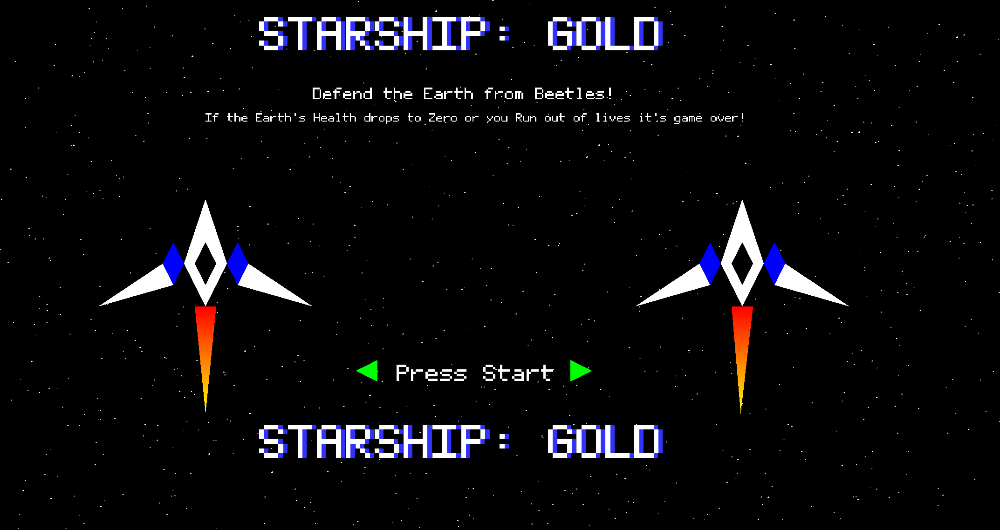
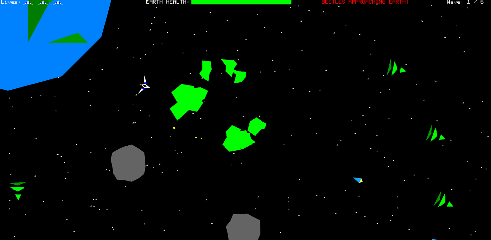

STARSHIP

A wave-based arcade space shooter where you defend Earth from invading alien forces.

---

Overview

BEETLES are coming to destroy the Earth!

Shoot down the invading BEETLES before they reach the planet, but beware of the WASPS and ENEMY SHIPS that will try to destroy you first.

You lose if:

Earth runs out of health
You run out of lives

Between waves, choose upgrades to strengthen your ship and prepare for increasingly difficult enemies.

Survive 6 waves to win the game :)

---
Controls

Attract Controls
Keyboard
Space	= Start Game
ESC	= Exit Application
Controller
Start	Start = Game
B	= Exit Application
In-Game Controls
Keyboard
E	 = Move Forward
D	= Move Backward
S	= Turn Left
F	= Turn Right
Space	= Shoot
N	= Respawn
P	= Pause
ESC	= Return to Start Screen / Quit
Shift = (if unlocked)	Dash

Note: Dash becomes available after obtaining the Dash upgrade.

Controller
Left Thumbstick	= Move / Turn
A	= Shoot
B	= Respawn
X	= Dash (if unlocked)
Start	= Pause
Debug Controls
P	= Pause
T	= Slow Motion
O	= Step Frame
F1	= Toggle Debug View
F8	= Reset Game
Features
6 Waves of Increasing Difficulty
Multiple Enemy Types
Beetles
Wasps
Enemy Ships
Upgrade System Between Waves
Dash Ability
Earth Defense Objective
Keyboard and Controller Support
Debug Tools for Development

Good luck, pilot. 🫡
